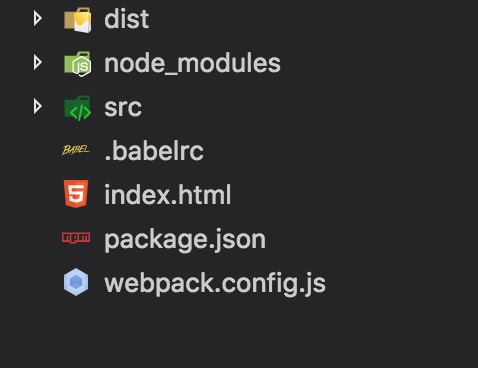

&emsp;&emsp;从年前到现在一直在找工作，也由于家里的一些事情耽搁。所以，搁置已久的日志，是时候重新拾起记录了。由于之前在项目中尽量用的脚手架，甚至有些小项目根本就没有搭建什么框架。于是，今天琢磨了一下全手动搭建react+webpack+babel开发环境。一方面填坑，另一方面借此机会熟悉一下这些工具的API。以下正文：
## 一、npm初始化
> npm init

&emsp;&emsp;npm是时下相对流行的包管理器,使用此命令创建package.json文件，这个文件包含了项目中所有包的版本信息、依赖关系等。
## 二、安装webpack
> npm install webpack -g

&emsp;&emsp;安装完成后，在项目根目录创建一个webpack.config.js用于配置webpack。一定要全局安装。
### 1.entry
&emsp;&emsp;用于配置项目入口文件
### 2.output
&emsp;&emsp;用于配置打包后文件的去向。其中，filename表示打包后的js叫什么名字，path表示打包后的文件所在的目录。如：`path=__dirname+"/dist",filename="bundle.js"`表示执行package打包后，在项目根目录下会新建一个dist文件夹，其中包含一个bundle.js文件，这个文件就是打包后的js。
### 3.devServer
> npm install --save-dev webpack-dev-server

&emsp;&emsp;用于配置webpack服务器。这部分配置比较关键，这是webpack提供的热更新功能，即时修改，即时出效果。其中比较主要的几个配置有：
> **conentBase**。服务器启动后访问的根目录，比如：`contentBase:"./dist"`表示服务器开启后访问的是当前项目下的dist目录。
> **inline**。其值为布尔值，如果设置为true，表示开启热更新功能。否则不开启。
> **port**。用于设置服务端口，默认是8080。
> **historyApiFallback**。布尔值，这个属性设置在spa项目开发中非常有用，如果设置为true，所有的跳转将指向index.html

注意：
&emsp;&emsp;1.webpack-dev-server指令用于启动webpack服务器，如果在后面加上`--content-base`表示服务器启动后访问devServer配置中contentBase指定的目录。如果为缺省值，表示访问当前项目的根目录。
&emsp;&emsp;2.“__dirname”是node.js中的一个全局变量，它指向当前执行脚本所在的目录。
### 4.loaders配置
&emsp;&emsp;loaders配置写在module模块下。通过使用不同的loader，webpack通过调用外部的脚本或工具可以对各种各样的格式的文件进行处理，比如说分析JSON文件并把它转换为JavaScript文件，或者说把下一代的JS文件（ES6，ES7)转换为现代浏览器可以识别的JS文件。或者说对React的开发而言，合适的Loaders可以把React的JSX文件转换为JS文件。其中主要的配置属性有：
> **test**。一个匹配loaders所处理的文件的拓展名的正则表达式（必须）。如：`test:"/\.jsx$/"`表示匹配所有的jsx语法，还有json、js、img、css、less、scss等文件格式匹配。
> **loader**。指定loader名称。如： `babel、json、babel-loader、css-loader、style-loader`等。
> **include/exclude**。手动指定包含/不包含的文件或文件夹。如：node_modules中的文件一般是不需要我们用loader进行转换的，可以手动排队这个文件夹下的所有文件。使用`exclude:/node_modules/`
> **query**。一些额外的配置。

## 三、babel安装和配置
> npm install --save-dev babel-core babel-loader babel-preset-es2015 babel-preset-react

&emsp;&emsp;`babel-core`是babel的核心库，babel-loader是jsx的loader,babel-preset-es2015是es6的转换器，babel-preset-react是react的语法转换器。
&emsp;&emsp;配置babel有两种方式：
### 1.在webpack的loader里配置
&emsp;&emsp;在loader里加上query:{presets:['es2015','react']}
### 2.配置.babelrc文件
&emsp;&emsp;新建.babelrc文件，按照如下配置即可。
```code
{
    "presets": ["es2015","react"]
}
```

## 四、配置完成。开始工程
> npm install --save react react-dom

### 1.安装好react和react-dom开发包，就可以进行开发工作了。我的项目目录如下图所示：

### 2.在src下新建main.js文件，其中的代码也很简单，就是用react在页面输出一个hello world（这貌似是业界接触新技术的必写经典案例，哈哈。）
```code
import React from "react"
import ReactDOM from  "react-dom"
ReactDOM.render(
    <h1>hello,worlddddd</h1>,
    document.getElementById("root")
)
```
### 3.在项目根目录新建index.html，其内容非常简单，仅仅是在body里添加一个id为root的div。然后引入外部js，这里js的路径要注意了，因为我们要导入的是打包好的js文件，所以，script的src值应该是`./dist/bundle.js`，否则页面不能引用到main.js里的内容。
### 4.执行webpack进行打包
### 5.执行webpack-dev-server --content-base。可以看到hello world正常显示出来了。此时个性main.js里的内容，页面上会实时更新。

## 五、写在后面
&emsp;&emsp;当我执行webpack后，发现在打包的dist目录下，并没有找到我的index.html文件，按道理来说，html文件不是应该随着打包一起进去的吗，否则我在发布的时候没有html怎么行。后来百度才发现，漏掉了最重要的一个东西：`HtmlWebpackPlugin`。这个插件的作用是依据一个简单的模板，帮你生成最终的Html5文件，这个文件中自动引用了你打包后的JS文件。每次编译都在文件名中插入一个不同的哈希值。也就是说，有了这个配置，在html中根本不需要我们手动引入js文件，打包的时候html会根据配置自动引入。
### 1.安装
> npm install --save-dev html-webpack-plugin

### 2.配置
&emsp;&emsp;在webpack配置文件中顶部加入：`var HtmlWebpackPlugin = require('html-webpack-plugin')`。在plugins里进行如下配置：
```code
plugins:[
        new HtmlWebpackPlugin({
            title:"react demo",
            filename:"index.html",
            template:"index.html",
            inject:true
        })
]
```
> **title**:表示html中title的值
> **filename**:输出的 HTML 文件名，默认是 index.html, 也可以直接配置带有子目录。
> **template**: 模板文件路径，支持加载器，比如 html!./index.html
> **inject**: true | 'head' | 'body' | false  ,注入所有的资源到特定的 template 或templateContent 中，如果设置为 true 或者 body，所有的 javascript 资源将被放置到 body 元素的底部，'head' 将放置到 head 元素中。

### 3.去掉html中的script引用，执行webpack
&emsp;&emsp;执行了webpack后，你会发现dist目录下多了个index.html，打开发现在body部分自动引入了bundle.js。
## 六、总结
&emsp;&emsp;本文总结了手动搭建react开发环境的步骤及部分注意点，尽管都是些基本配置，但不得不注意这个过程中多数的坑，只有经历了才知道。可能我的总结不尽完整，后续开发过程中配置肯定会越来越复杂，坑也会有的，先就这些吧。未完待续......

