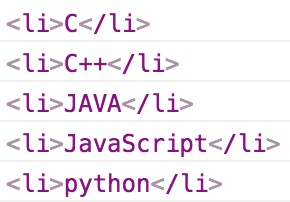

刚看到原生js操作节点这部分，于是动手敲了几行代码练习一下节点操作方法的应用。真没想到还遇到了一个棘手的问题，下面进入正题：
首先，我在body里边简单写了个无序列表，如下：
```html
    <ul id="list" style="list-style:none;">
       <li>C</li>
       <li>C++</li>
       <li>JAVA</li>
       <li>JavaScript</li>
    </ul>
```
然后，我在js里边都干了些什么呢？
```javascript
    var ul=document.getElementById('list');
    var suanfa=document.createElement('li');
    var suanfa_text=document.createTextNode('python');
    suanfa.appendChild(suanfa_text);
    ul.insertBefore(suanfa,ul.lastChild);
    var nodes=ul.children;
    for(var i=0,len=nodes.length;i<len;i++){
        console.log(nodes[i]);
    }
```
第1句获取ul的DOM对象，第2句到第4句创建了一个新的li节点，并为它添加了文本“python”，然后把新节点插入在了ul的倒数第2个子节点上。最后，循环输出每个子节点信息。此时，机智的你是不是会认为，下面就是输出结果：

然而，并不是！！！真正的输出结果是下面这个：

纳尼？？？你是不是也在想，明明是在lastChild进行的insertBefore，为什么python还是排到最后一个去了？我之前也想不明白，直到我把var nodes=ul.children换成了childNodes，再打印出来，请看：

这一看结果，相信你也就明白了。尽管我们知道，节点的children属性不会获取文本节点，而childNodes会获取文本节点。但不曾想过，js的节点插入操作将非元素结点也算作子节点的！所以，我上面的insertBefore不过是在最后那个#text元素前面插入了一个li元素，显示的时候，它还是所有li元素当中的最后一个，因此出现了之前那个问题。

解决方案：
```javascript
    var ul=document.getElementById('list');
    var suanfa=document.createElement('li');
    var suanfa_text=document.createTextNode('python');debugger;
    suanfa.appendChild(suanfa_text);
    ul.insertBefore(suanfa,ul.children[ul.children.length-1]);
    var nodes=ul.children;
    for(var i=0,len=nodes.length;i<len;i++){
        console.log(nodes[i]);
    }
```
即，将insertBefore的第二个参数换成ul.children[ul.children.length-1]，实际上就是利用children属性只返回节点，不获取属性和文本的特性，以此获取最后一个子元素对象，再插件元素。其实，理解了以后就会发现，这种情况也就是在正数第2个位置和倒数第2个位置插入元素会产生异常（前提是除了li没有别的元素）。

最后，关于#text的一些思考：哪些情况下会产生#text文本节点？jQuery中的befor和after方法是怎样封装的？望各位大大多多指点。