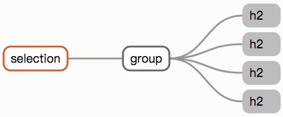
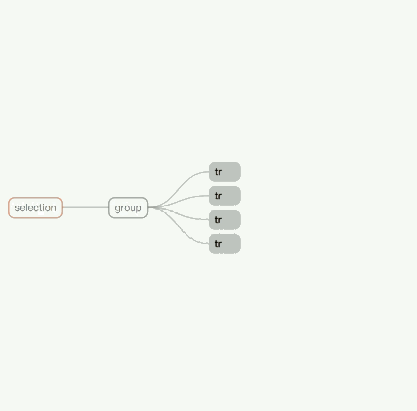
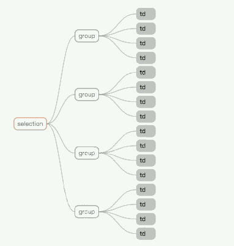
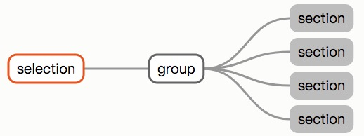
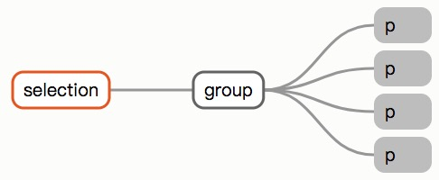
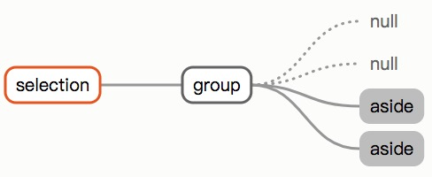
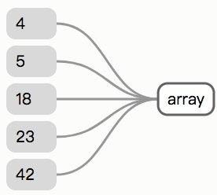
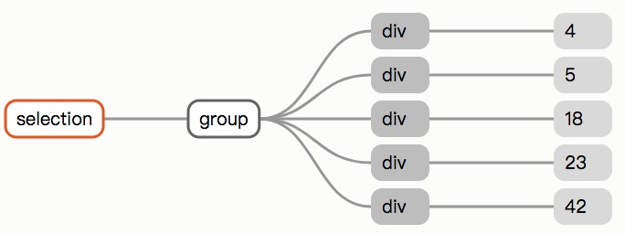

原文链接：[https://bost.ocks.org/mike/selection/](https://bost.ocks.org/mike/selection/)

以前，我对D3的选择集有过一些简单的描述，其中的讲解仅限于入门。 这篇文章以更加全面的方式讲解如何使用选择集，我会说明选择集是如何执行的。这篇文章有点长，但它将消除你的诸多疑虑并助你掌握数据驱动文档（Data-Drive Documents）。

这篇文章的开头似乎让人觉得有点随意，它讲述的是selections的内部工作原理而并非设计的动机，因此你可能会疑问为什么要以这种方式呈现。很简单，在解释所有东西是如何工作之前，先把所有的东西放在一起比较容易。等你读到最后，设计意图和功能也逐渐清晰。

D3是一个可视化库，因此这篇文章会伴随讲解一些可视化方面的知识。在下面的示意图中，左边的图将会展示selections的结构，右边的图将会展示数据结构。
<!--  -->

圆角矩形比如：<span style="background:rgb(217,217,217);padding:3px 5px;border-radius:5px;">thing</span>表示各种类型的JavaScript对象，包括对象字面量，数字组成的数组以及DOM元素。确定的对象类型用不同的颜色标识，包括<span style="border:1px solid rgb(227,86,33);padding:3px 5px;border-radius:5px;">selection</span>、<span style="border:1px solid rgb(97,97,97);padding:3px 5px;border-radius:5px;">array</span>以及<span style="background:rgb(185,185,185);padding:3px 5px;border-radius:5px;">element</span>。从一个对象到另一个对象的引用用关联线来表示（——）。比如，一个包含数字42的数组是这样的：

```
var array = [42];
```
<span style="border:1px solid rgb(97,97,97);padding:3px 5px;border-radius:5px;">array</span>——<span style="background:rgb(217,217,217);padding:3px 5px;border-radius:5px;">42</span>

只要有可能，生成给定选择集的代码就会立即出现在图的上方。打开浏览器的JavaScript控制台并以交互方式创建选择集是测试你对文本理解的好方法！

~正文从这里开始

### 一、数组的子类

你可能会说，选择集不就是DOM元素组成的数组嘛！错！一方面，选择集是数组的一个子类，这个子类提供了操作被选中的selections的方法，比如说设置属性和样式。选择集同样继承数组的原生方法，比如说array.forEach及array.map。然而，你将很少用到数组的原生方法，因为D3提供了更加便利的替代方案，比如selection.each(为了适应selections的书写规范，少许几个原生方法被D3重写了，即selection.filter和selection.sort)。

### 二、分组元素

选择集不同于数组的另一个原因是，选择集是元素的数组的数组：一个选择集是一个包含众多分组的数组，并且每一个分组是一个包含众多元素的数组。比如’d3.select‘方法返回一个group的集合，而这个group包含的是被选中的元素：

```
var selection = d3.select("body");
```

<span style="border:1px solid rgb(227,86,33);padding:3px 5px;border-radius:5px;">select</span> —— <span style="border:1px solid rgb(97,97,97);padding:3px 5px;border-radius:5px;">group</span> —— <span style="background:rgb(185,185,185);padding:3px 5px;border-radius:5px;">body</span>

在javascript控制台，试着运行这段代码，并且查看一下分组selection[0]以及节点`selection[0][0]`。D3的API提供了直接访问节点的入口，最为常见的是使用selection.node。

同样的，d3.selectAll返回一个组和任何数量的元素的选择集：

```
d3.selectAll("h2");
```
<!--  -->

d3.select和d3.selectAll返回的选择集都有一个组，获取包含多个组的选择集的唯一方法是selection.selectAll。比如，如果你要选择一张表的所有的行元素，并且随后选择每一行的所有单元格，你会获取到一组包含多个单元格的group分组：

```
d3.selectAll("tr").selectAll("td");
```
<!--  -->

通过selectAll，旧的选择集中的每一个元素都会在新的选择集中变成一个分组；每个组包含一个旧元素及其匹配的后代元素。因此，如果每个单元格中包含一个'span'元素，并且你后续进行第三次selectAll调用，你将得到一个包含16个分组的选择集。

```
d3.selectAll("tr").selectAll("td").selectAll("span");
```
<!--  -->


每个组都有一个parentNode属性，用于存储所有组元素的共享父元素。父元素在创建组的时候被设置，如果你调用d3.selectAll("tr").selectAll("td")，返回的选择集是包含td元素的分组，它们的父节点是tr元素。对于d3.select和d3.selectAll方法返回的结果集，它们的父元素是html。

更多时候，你可以忽略那些被分组的选择集。当你给attr或者style赋值为一个函数时，这个函数会被选择集中的每一个元素调用，分组和元素集最主要的区别在于函数的第二个参数i，i表示的是组内的索引而并非选择集内索引。

### 三、非分组操作

只有selectAll可以产生分组行为，select保留现有分组。select方法不同，因为每个元素的选择中只有一个元素。因此，select会将数据从父节点传送到子节点，而selectAll不会！

append和insert方法是基于select之上的包装，所以它们也会保存分组及传送数据。比如：给一个document添加4个section元素：

```
d3.selectAll("section");
```
<!--  -->

如果你给每个section元素添加一个p元素，新的选择集同样只有唯一一个分组

```
d3.selectAll("section").append("p");
```
<!--  -->


注意：这个selectAll选择集的parentNode依然是html元素，因为selection.selectAll被调用并不会导致重新分组

### 四、空元素

分组可以包含null以表示丢失的元素，null元素被众多操作所忽略；比如，D3在设置属性和样式的时候会跳过null元素。

当selection.select不能找到和给定选择器相匹配的元素时，就会产生null元素。select方法必须维持既有的分组结构，所以会用null来占位。比如，如果在上面的例子中只有最后两人个section元素中含有aside元素：

```
d3.selectAll("section").select("aside");
```
<!--  -->

和分组一样，你可以忽略null空元素。不过你要注意的是，null空元素依然维持着它的分组结构以及它的组内索引。

### 五、数据绑定

令人意外的是，data并不是选择集的属性，而是其元素的属性。这意味着当你给选择集绑定数据集时，数据是被存储在DOM元素上的，而不是存储在选择集里（数据被存储在元素的一个叫做`__data__`的属性中）。如果一个元素没有这个属性，则其关联数据为undefined。因此数据是持久的而选择集可以被看作是暂时的（你可以重新选择DOM中的元素，并保留着之前绑定的数据）。

数据可以通过以下几种方式被绑定到元素上：

> 1.通过selection.data将数据绑定到元素上；

> 2.通过selection.datum分配给各个元素；

> 3.通过append、insert或select从父元素继承数据绑定

虽然没有必要直接设置`__data__`属性，可以使用selection.datum来绑定，但这样做可以说明如何实现数据绑定：

```
document.body.__data__ = 42;
```
<!--  -->

相当于选择body元素并为它绑定数据：

```
d3.select("body").datum(42);
```
<!--  -->

如果我们现在在body元素下面再添加一个元素，那么其子元素会自动继承来自父元素的数据：

```
d3.select("body").datum(42).append("h1");
```
<!--  -->

以上阐明了最后一种绑定数据的方法，在进一步的探索之前，我们必须回答更具现实意义的问题。

### 六、什么是数据

D3中的数据可以是任何值的数组。比如，数值型数组：

```
var numbers = [4, 5, 18, 23, 42];
```

或者包含对象的数组：

```
var letters = [
  {name: "A", frequency: .08167},
  {name: "B", frequency: .01492},
  {name: "C", frequency: .02780},
  {name: "D", frequency: .04253},
  {name: "E", frequency: .12702}
];
```


甚至包含数组的数组：

```
var matrix = [
  [ 0,  1,  2,  3],
  [ 4,  5,  6,  7],
  [ 8,  9, 10, 11],
  [12, 13, 14, 15]
];
```

我们可以通过可视化呈现选择集与数据的映射关系，这里有一个5个数字的简单数组：
<!--  -->

就像selection.style使用一个常量字符串来为每一个选定的元素定义一个统一的样式属性，或者通过函数来返回每个元素的动态样式(`function(d) {return d.color; }`)，selection.data可以接受一个常量值或一个函数。

然而，与其他的选择集方法不同，selection.data为每个组定义数据而不是每个元素（数据被表示为与组对应的数组，或是返回类似数组的函数。因此，一个被分组的选择集具有相应的分组数据）
<!--  -->


图中的蓝线表明返回关联数组的函数，数据函数传递组的父元素的数据(d)及其组内索引(i)，并返回你想要加入组内的所有数据的数组。因此，数据通常表示的是绑定到父元素的数据函数，便于从分层数据创建分层DOM元素。

对于只有一个组的选择，可以直接将相应的单个数组传递给selection.data；你只有在将不同的数据绑定到不同分组的时候才需要函数操作

### 七、关键知识点

要将数据和元素关联，我们必须知道哪个元素对应哪个数据，这归功于一组配对的键，一个键是一个标识字符串，比如说名称，当一个数据的键和元素的键相等时，这个数据就被分配给对应的这个元素。

索引是分配键最简单的方式（第一个数据和第一个元素有相同的键“0”，第二个数据和第二个元素有相同的键“1”，依次类推......）。将一组数据连接到匹配的paragraph元素数组，因此看起来像这样，键显示为绿色：

```
var numbers = [4, 5, 18, 23, 42];
```
<!--  -->


现在，选择的结果集就是绑定到数据的元素：

```
d3.selectAll("div").data(numbers);
```
<!--  -->

如果你的数据和元素都是按照既定的顺序排列的，那么按照索引匹配无疑是最方便的。然而，当顺序不同的时候，按照索引匹配不再可取！在这个例子中，你可以指定一个键函数作为data方法的第二个参数传进去。键函数返回指定的数据或元素的键值，如果你的数据是包含对象的数据，而每个对象都有一个name属性，你的键函数就可以返回关联的name：

```
var letters = [
  {name: "A", frequency: .08167},
  {name: "B", frequency: .01492},
  {name: "C", frequency: .02780},
  {name: "D", frequency: .04253},
  {name: "E", frequency: .12702}
];

function name(d) {
  return d.name;
}
```
<!--  -->

由此，所选元素现在绑定到数据。 这些元素也被重新排序以匹配数据

```
d3.selectAll("div").data(letters, name);
```
<!--  -->


对于大型分组选择，这个过程可能相当复杂。但由于每个分组独立关联，因此被简化。因此，你只需要担心组内的唯一键，而不是整个选择集。
<!--  -->


上面的例子假设数据和元素之间有一个精确的1：1匹配。 但是，如果给定的数据没有匹配的元素，或给定的元素没有匹配的数据，会发生什么？

### 八、Enter、Update及Exit

当按键将元素加入数据时，有三种可能的逻辑结果：

1、Update-对于给定的数据能找到匹配的元素

2、Enter-对于给定的数据不能找到匹配的元素

3、Exit-对于给定的元素找不到匹配的数据

以上就是由selection.update、selection.enter、selection.exit各自返回的三类结果集。想象一下，你有一个字母表的前五个字母的条形图(ABCDE)，你想过渡到你最喜欢的五个元音(YEAOI)，你可以使用键功能在转换中保持字母之间的关联，从而产生以下数据连接：
<!--  -->


之前显示的两个字母（A和E）是元音，这些条形按照新数据的顺序放置在更新选项中：

```
var div = d3.selectAll("div").data(vowels, name);
```
<!--  -->


另外三个显示的字母（B，C和D）是辅音，因此在新数据集中没有相应的数据。 这些元素因此被放置在Exit选择集中。 请注意，Exit选择集会保留原始选择的顺序，在移除之前进行动画制作时，此选项有时很有用：

```
div.exit();
```
<!--  -->

最后，三个元音（Y，O和I）以前没有显示，因此没有相应的元素。 这些形成了Enter选择集：

```
div.enter();
```
<!--  -->

Update和Exit是常用的选择集，Enter则是选择集的一个子集。这是必要的，因为它代表了还不存在的元素，Enter选择集包含了占位符而并非实际存在的DOM元素，这些占位符只是具有`__data__`属性的对象。当后续插入节点时，这些新节点会替换原有的占位符而成为Enter中的新成员。

### 九、合并Enter和Update

数据的一般更新模式是添加缺省的元素并移除多余的元素，同时修改更新元素的动态属性、样式以及其他属性。通常，更新和缺省元素的属性之间有重叠。

为了减少重复的代码，enter.append有一个方便的附加功能：它使用enter选择集中新创建的元素替换update选择集中的null。因此，在enter.append之后，update选择集被修改为包含enter和update元素。 随后update选择集就包含所有当前显示的元素：
<!--  -->


自此，数据关联的生命周期就完成了。